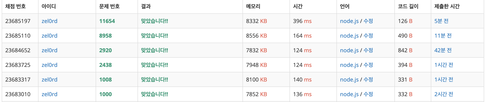

### beakjoon1000
```javascript
const readline = require('readline');
const rl = readline.createInterface({
  input: process.stdin,
  output: process.stdout
});

let input = [];

rl.on('line', function (line) {
    input = line.split(' ').map((el) => parseInt(el));
  })
  .on('close', function () {
    console.log(input[0] + input[1]);
    process.exit();
  });
```

### beakjoon1008
```javascript
const readline = require('readline');
const rl = readline.createInterface({
  input: process.stdin,
  output: process.stdout
});

let input = [];

rl.on('line', function (line) {
    input = line.split(' ').map((el) => parseInt(el));
  })
  .on('close', function () {
    console.log(input[0] / input[1]);
    process.exit();
  });
```
### beakjoon2438
```javascript
const readline = require('readline');
const rl = readline.createInterface({
  input: process.stdin,
  output: process.stdout
});

rl.on('line', function (line) {
    Array.from({length: line}, (x,i) => i+1)
    .forEach(function(v){
      console.log("*".repeat(v))
    });
    process.exit();
  })
  .on('close', function () {
    // console.log(input[0] / input[1]);
    process.exit();
  });
```
### beakjoon2920
```javascript
const readline = require('readline');
const rl = readline.createInterface({
  input: process.stdin,
  output: process.stdout
});

function sortAsc(arr){
  arr = arr.sort(function(a,b){
    return a - b;
  })
  return arr
}

function sortDes(arr){
  arr = arr.sort(function(a,b){
    return b - a;
  })
  return arr
}

rl.on('line', function (line) {
    line = line.split(' ').map((el) => parseInt(el));
    let jsonLine = JSON.stringify(line)
    let jsonAsc = JSON.stringify(sortAsc(line))
    let jsonDes = JSON.stringify(sortDes(line))

    if (jsonLine === jsonAsc){
      console.log("ascending")
      process.exit();
    }else if (jsonLine === jsonDes){
      console.log("descending")
      process.exit();
    }else {
      console.log("mixed")
      process.exit();
    }
  })
  .on('close', function () {
    process.exit();
  });
```
### beakjoon8958
```javascript
let fs = require('fs');
let input = fs.readFileSync('/dev/stdin').toString().split('\n');

let count = parseInt(input[0]);
let numbers = new Array(count).fill(0);

function getScore(string){
  let score = 0
  let temp = 1

  string.split("").forEach(function(n){
    if (n === "O"){
      score += temp
      temp += 1
    } 
    else{
      temp = 1
    }
  })
  console.log(score)
  return score
}

for (let i = 0; i < count; i++) {
  numbers[i] = input[i+1]
}

numbers.forEach(getScore)
```

### beakjoon11654
```javascript
let fs = require('fs');
let input = fs.readFileSync('/dev/stdin').toString().split('\n');

console.log(input[0].charCodeAt(0))
```


