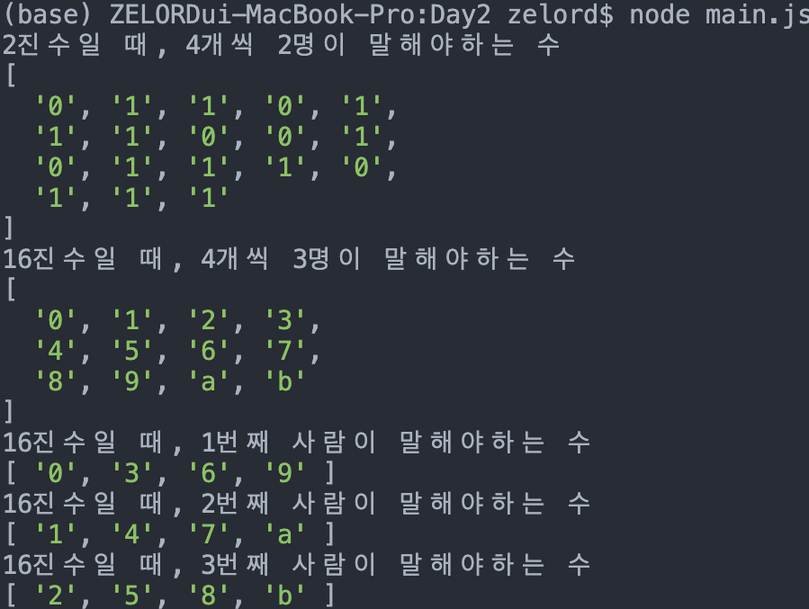

# 코드스쿼드 마스터즈 코코아 JS


## Daily Mission1
2진수 돌아가며 말하기 게임 (for문은 최대한 사용하지 않기)

## CODE
```javascript
// (사람 수 * 갯수) 해당 진법으로 변환하여 문자열로 리턴
function arrayToString(base, range, numOfPeople){
    let result = "";
    const decRange = [...(Array(range * numOfPeople).keys())]

    decRange.forEach(function (n){
        result += n.toString(base)
    })

    return result
}

// 문자열에서 차례에 해당하는 숫자를 배열로 리턴
function getTurns(string, numOfPeople, turn){
    let result = [];
    let realIndex = [];
    let tempIndex = Array.from({ length: parseInt(string.length / numOfPeople) }, (_,i) => i * numOfPeople)

    tempIndex.forEach(function(element, index){
        realIndex.push(element + turn - 1)
    })
    
    realIndex.forEach(function(element, index){
        result.push(string[element])
    })

    return result
}

function solution(base, range, numOfPeople, turn){
    const string = arrayToString(base, range, numOfPeople)
    
    if(turn === undefined){ // turn이 없을 경우는 말해야하는 수만 출력
        console.log(`${base}진수일 때, ${range}개씩 ${numOfPeople}명이 말해야하는 수`)
        console.log(string.split(""))
    } else{ // turn이 있는 경우 string에서 말해야하는 수만 출력
        result = getTurns(string, numOfPeople, turn)
        console.log(`${base}진수일 때, ${turn}번째 사람이 말해야하는 수`)
        console.log(result)
    }
}

solution(2,4,2)
solution(16,4,3)
solution(16,4,3,1)
solution(16,4,3,2)
solution(16,4,3,3)
```

## 수행결과



## [미션] 진법 돌아가며 말하기 게임
문제1) T개의 숫자까지 M명이 말한다고 할때 이를 모두 출력하는 프로그램을 만든다.  
문제2) 길동이 차례 숫자 맞추기  
문제3) n진수까지 되는 프로그램  

### 체크포인트
- 진법에 대해서 이해하고 있다. [0]  
- 자바스크립트로 진법변환하는 방법을 안다. [0]  
- 배열의 순회하고 추가/삭제 하는 방법을 안다 [0]  


## DailyMission2
