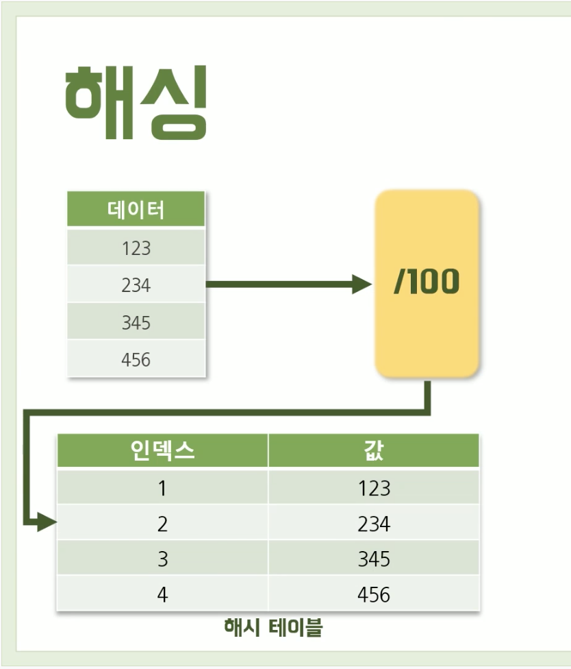
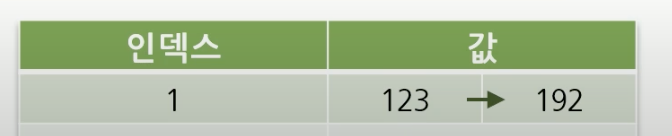
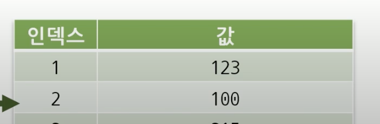
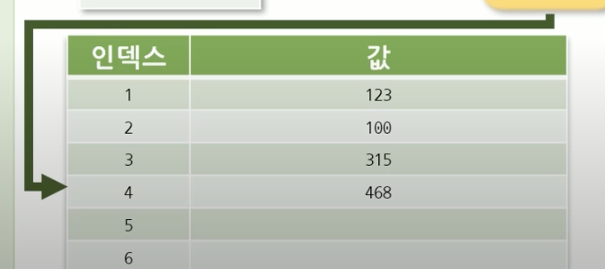

## 객체지향 설계와 프로그래밍

### class
- field와 method가 종합적으로 묶여있는 것
- class를 이용하여 상속과 다향성이 존재

```jsx
class person{
    name;   # field (속성)
    age;    # field (속성)
    speak() # method (행동)
}
```
class : 붕어빵을 만들 수 있는 틀
- template
- declare once
- no data in 

object : class를 이용하여 새로운 instance를 만들면 object
- instance of a class
- crated many times
- data in

### 1. Class declarations

class.js 참고


## 자바스크립트 프로토타입과 클래스
```jsx
function Person() {
    this.eyes = 2;
    this.nose = 1;
}

var kim = newPerson();
var park = newPerson();

console.log(kim.eyes, kim.nose) // 2, 1
console.log(park.eyes, park.nose) // 2,1

// prototype
function Person() {
    Person.prototype.eyes = 2;
    Person.prototype.nose = 1;
}

var kim = new Person();
var park = new Person();

console.log(kim.eyes, kim.nose) // 2, 1
console.log(park.eyes, park.nose) // 2,1
```
### Prototype Link, Prototype Object

Prototype Link와 Prototype Object를 통틀어 Prototype이라고 부름

#### Prototype Object
```jsx
function Person() {} // => 함수
var personObject = new Person(); // => 함수로 객체를 생성
```

<!-- https://medium.com/@bluesh55/javascript-prototype-%EC%9D%B4%ED%95%B4%ED%95%98%EA%B8%B0-f8e67c286b67 -->


- 데이터 관리/유지를 위한 자료구조
- 리소스 < 속도
- 데이터 → 해시함수 → 인덱스(키-버킷):값(밸류-엔트리) = (해시테이블)

    

- 해시의 문제점인 충돌을 해결하는 방법
    1. Chaining(체이닝)
        - 값 뒤에 이어 붙힘

            

    2. Linear Probing(선형탐사)
        - 비어있는 다음 인덱스에 값을 삽입

            

    3. Resizing(리사이징)
        - 선형탐사를 하고 자리가 없으면 테이블을 다시 만듦

            


# Day3

# 해시맵 구현
- 문자열 키와 문자열 값을 저장하는 해시맵 라이브러리 구현
- 해쉬 자료구조 이해
- 해시 충돌방지 구현
- class 사용


# OOP
- 소프트웨어의 크기가 커지면 이를 객체 단위로 만들어서 큰 그룹을 지어 프로그래밍
- 자바스크립트는 객체지향언어라고 하기 어렵다(객체없이 프로그래밍 가능)
- 현대의 프로그래밍에서는 객체 단위로 프로그래밍을 하는 것이 여러가지 선택지 중 하나
- (참고로 자바스크립트에서도 함수형프로그래밍 방법이 많이 활용되고 있고, 객체지향과 함수형프로그래밍 패러다임을 섞는 경우도 많다.)

## 객체란?
- 모든 것이 객체다
- 어떠한 사물 === Object

## 객체의 구성
- 모든 객체는 속성(property)과 행위(method)를 가질 수 있음
- 속성, 필드, property는 같은 말
- 함수, 메서드도 같은 말 

```jsx
Class {
    this.height = 180;
    this.age = 22;
    eat= function() [

    ]
}
```

## 클래스와 객체
- class는  어떠한 객체를 표현하기 위해, 일반화된 형태로 만든 것
- 어떠한 집합이나 분류에 가까움
- 객체는 인스턴스라고 하며, class를 통해서 얻을 수 있는 것으로 볼 수 있음
- 따라서 유일한 사물이라고 볼 수 있으며, 꼭 그런 것은 아니지만 실체에 가깝다
- console(객체), log(메서드)


# OOP란

## OOP의 핵심개념
- Class
- 캡슐화
- 상속
- 다형성
- 추상화

## JavaScript OOP 표현방식 - ES Classes
- JavaScript에서는 OOP 프로그래밍 구조를 만들기 위해서 객체를 표현하는 다양한 방식이 존재
- 가장 친숙하고 현대화된 방식은 CLASS 문법을 사용
- CLASS 문법은 ES2015에 추가된 것으로 ES Classes라고 일컫는다.
- JAVA 와 같은 객체지향프로그래밍 언어에서 표현하는 것처럼 ES Classes역시 class안에 property 와 method가 존재한다. 
- 또한 constructor도 존재한다.
- constructor(생성자)는 class를 new키워드로 호출할때 자동으로 실행되고, 자동으로 객체(이렇게 생성되는 객체는 instance라고도 한다)를 반환한다.

```jsx
class Health {
  constructor(name, healthTime) {
    this.name = name;
    this.healthTime = healthTime;
  }

  showHealth(){
     console.log(this.name + "님, 오늘은 " + this.healthTime + "에 운동을 하셨네요");
  }

}

const ho = new Health("crong", "12:12");
ho.showHealth();

```

## JavaScript에서 객체 나누기
- UI개발에서는 객체(class)를 어떤것을 만들어야 할지, 그리고 어떻게 통신을 해야 할지 고민이 될 수 있다.
- 보통 화면에 보이는 영역을 구분한 뒤에, 각각을 하나의 객체로 나누는 것이 좋다.
- 객체의 크기를 어떻게 나눌지는 선택적인 문제다. 
- 작은 크기로 역할을 나눠서 각각을 객체로 만들 수도 있고, 그렇지 않을 수도 있다.
- 참고로 현대의 Framework개발에서는 UI요소를 component 단위로 작게 만들고 이를 객체 또는 함수로 표현해서 개발한다.


# OOP vs FP

 
- "What is a Pure Functino in JavaScript : https://www.freecodecamp.org/news/what-is-a-pure-function-in-javascript-acb887375dfe/