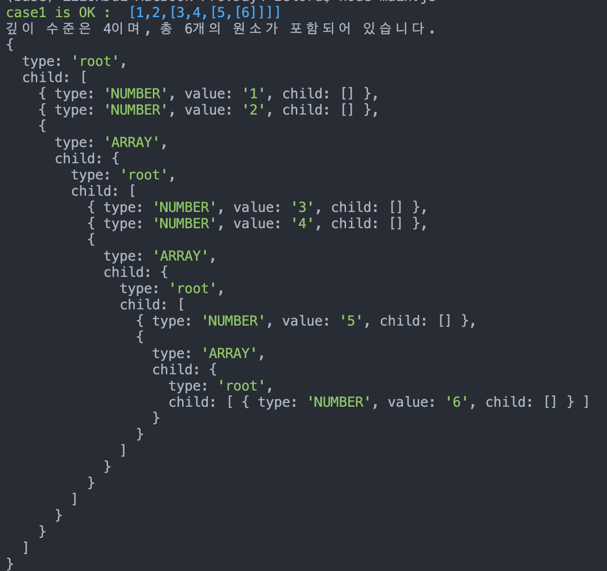
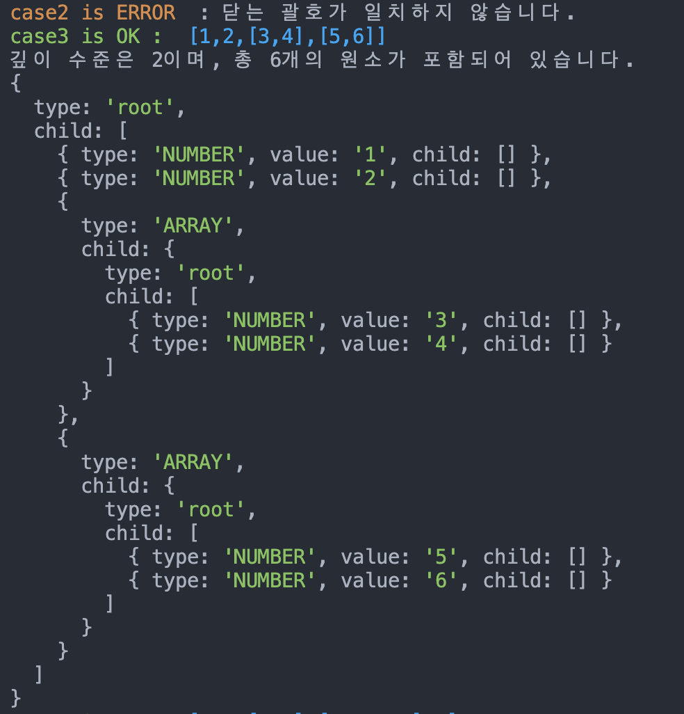
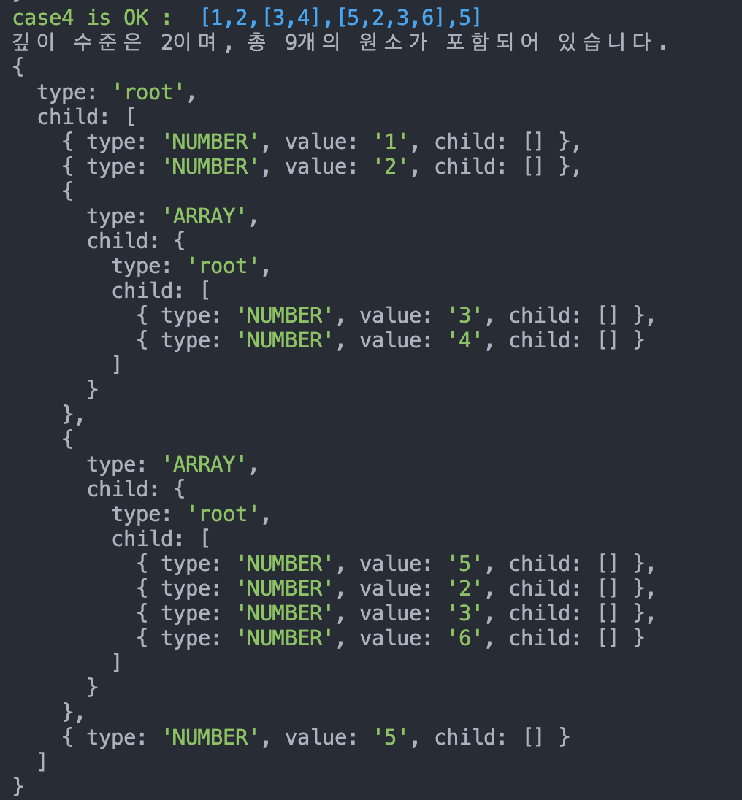
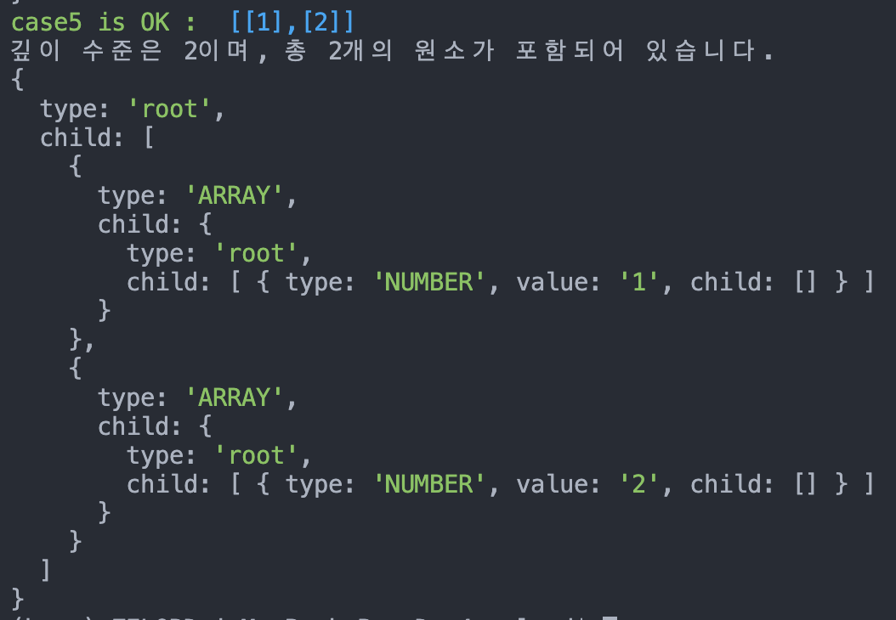

# DailyMission4

## 괄호문법 검사기

```jsx
// getDepth.js
function getDepth(str){
    let depth = 0;
    let eleCount = 0;
    let maxDepth = 0;

    str.split("").map(function (v){
        if (v === "["){
            depth += 1
            if (depth > maxDepth){
                maxDepth = depth
            }
        }
        else if (v === ","){
            eleCount += 1
        }
        else if (v === "]"){
            depth -= 1
        }
    })
    eleCount = eleCount ? eleCount += 1 : eleCount 
    return [maxDepth, eleCount]
}

module.exports = getDepth
```

```jsx
// bracketMatch.js
const [LEFT_BRACKET, RIGHT_BRACKET] = ["[", "]"];

const bracketMatch = (str) => {
  const queue = [];

  for (let ch of str) {
    if (ch === LEFT_BRACKET) queue.push(ch);
    else if (ch === RIGHT_BRACKET) queue.pop();
  }

  return queue.length === 0 ? true : false
};


module.exports = bracketMatch;
```
```jsx
// tokenizer.js
const getDepth = require('./getDepth');
const bracketMatch = require('./bracketMatch');

const [LEFT_BRACKET, RIGHT_BRACKET, COMMA, BLANK] = ["[", "]", ",", " "]

function isQuote(ch){
    ch === SINGLE_QUOTE || ch === DOUBLE_QUOTE ? true : false 
}

function tokenizer(str){
    const tokenArr = [];
    let token = "";
    const bracketStack = [];

    tokenArr.push(str.charAt(0))
    for (let i = 1; i < str.length-1; i++){
        const ch = str.charAt(i)
        
        if (ch === BLANK) continue;
        if (ch === LEFT_BRACKET) bracketStack.push(ch);
        if (ch === RIGHT_BRACKET) bracketStack.pop()
        if (ch === COMMA) {
            if (bracketStack.length === 0){
                tokenArr.push(token);
                token = ""
                continue
            }
        }
        token += ch
    }
    tokenArr.push(token)
    tokenArr.push(str.charAt(str.length - 1))
    return tokenArr
}

module.exports = tokenizer;
```
```jsx
// lexer.js
function getType(token) {
    const isLeftBracket = token === "[" ? 'leftBracket' : false
    const isRightBracket = token === "]" ? 'rightBracket' : false
    const isArray = token.charAt(0) === "[" && token.charAt(token.length -1) === "]"? true : false
    const isNumber = Number(token)

    const result = 
        isLeftBracket ? 'LEFT_BRACKET' 
            : isRightBracket ? 'RIGHT_BRACKET' 
            : isArray ? 'ARRAY'
            : isNumber ? 'NUMBER' 
                : 'STRING'
    return result
}

function lexer(tokenArr) {
    return tokenArr.map(function (v) {
        return { 'type':getType(v), 'value' : v }
    })
};

module.exports = lexer;
```
```jsx
// parser.js
const lexer = require('./lexer')
const tokenizer = require("./tokenizer")

function filterBracket(token) {
    return token.type !== "LEFT_BRACKET" && token.type !== "RIGHT_BRACKET"
}

function parser(lexerArr){
    return {
        type : 'root',
        child : lexerArr.filter(filterBracket).map( function (v) {
            let { type, value } = v

            if(type === "ARRAY"){
                return { type, child: parser(lexer(tokenizer(value)))}
            }
            else return {type, value, child: []}
        })
    }
}

module.exports = parser
```
```jsx
// main.js
const colors = require('colors');

const data = require('./data')
const lexer = require('./lexer');
const parser = require('./parser')
const getDepth = require('./getDepth');
const tokenizer = require('./tokenizer');
const bracketMatch = require('./bracketMatch');

function printDepth(result,key, data){
    console.log(`${key} is OK : `.green,`${data}`.blue,`\n깊이 수준은 ${result[0]}이며, 총 ${result[1]}개의 원소가 포함되어 있습니다.`)
}

function run(data, key){
    if (bracketMatch(data)){
        printDepth(getDepth(data), key, data)
        const result = parser(lexer(tokenizer(data)))
        console.dir(result, {depth : null})
    } else console.log(`${key} is ERROR`.yellow, ` : 닫는 괄호가 일치하지 않습니다.`)
}

for(let key in data){
    run(data[key], key)
}
```


## 실행화면




