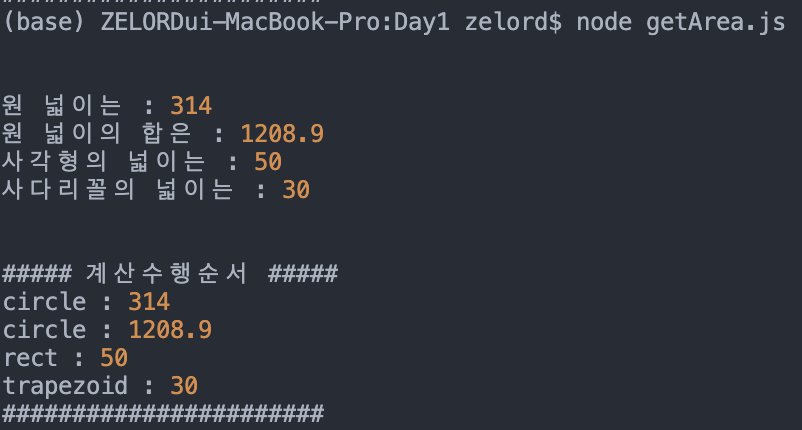

# 코드스쿼드 마스터즈 코코아 JS

## Daily Mission
getArea 함수를 만들어 여러 도형의 넓이를 구하여라.

## CODE

    const PI=3.14
    let sequence = [];

    function getArea(shape){
        if (shape === 'circle' && arguments.length == 2){
            let area = getCircle(arguments[1]);
            console.log("원 넓이는 :",area)
            sequence.push('circle')
        }
        if (shape === 'circle' && arguments.length == 3){
            let sum = getStepCircle(arguments[1],arguments[2])
            console.log("원 넓이의 합은 :", sum)
            sequence.push('circle')
        }
        if (shape === 'rect' && arguments.length == 3){
            let area = getRect(arguments[1],arguments[2]);
            console.log("사각형의 넓이는 :",area);
            sequence.push('rect');
        }
        if (shape === 'trapezoid' && arguments.length == 4){
            let area = getTrape(arguments[1],arguments[2],arguments[3])
            console.log("사다리꼴의 넓이는 :",area)
            sequence.push('trapezoid')
        }
    }

    // 원의 넓이
    function getCircle(length){
        return PI * length * length
    }

    // 반지름이 1부터 n까지 1씩 증가하는 원의 넓이
    function getStepCircle(length1,length2){
        let sum = 0;
        const range = (start, stop, step) => Array.from({ length: (stop - start) / step + 1}, (_, i) => start + (i * step));
        for (const element of range(length1,length2,1)){
            sum += getCircle(element)
        }
        return sum
    }

    // 사각형 넓이
    function getRect(length1, length2){
        return length1 * length2
    }

    // 사다리꼴 넓이
    function getTrape(length1, length2, length3){
        return (length1 + length2) * length3 / 2
    }

    // 계산수행 순서
    function printExecutionSequence(){
        console.log("계산수행순서 : ",sequence.join(", "))
        // return sequence.join(", ")
    }

    getArea("circle", 10);
    getArea("circle", 1,10);
    getArea("rect", 5,10);
    getArea("trapezoid", 5,10,4);
    printExecutionSequence();

## 수행결과

## [미션] 다각형의 넓이 구하기
1. getArea함수 만들기
2. printExecutionSequence 함수만들기
3. printExecutionSequence 함수 수정
4. debug 기술문서 정리하기
5. 학습 체크포인트
    - Node.js를 통해서 JavaScript개발을 할 수 있다
    - 함수의 역할은 한가지에 집중하고 있다.
    - 일관된 변수명과 함수이름을 짓고 있다.
    - 함수는 늘 동일한 입력값에 동일한 출력을 보장한다.
    - 개발과정에서 breakpoint나 'debugger;' 키워드를 사용해서 디버깅을 했다.